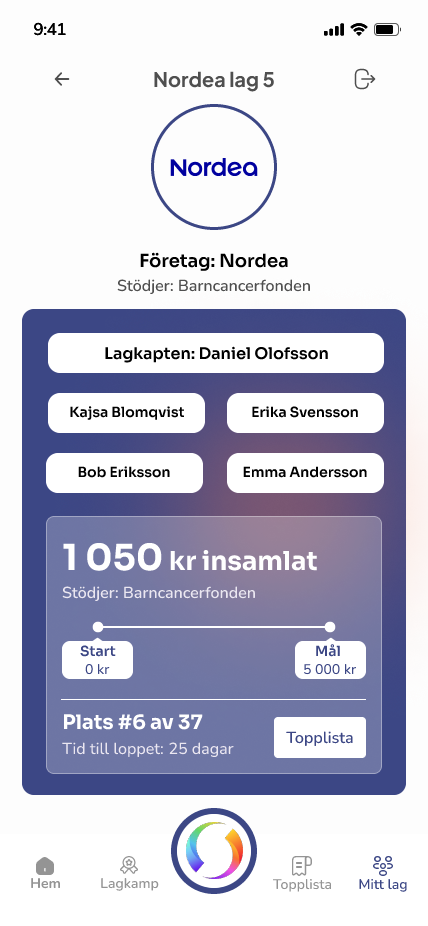

# Midnattsloppet Fortal 🏃 
A Charity-Focused App for Businesses and Organizations made with Flutter in a group of ten people as part of the course Projektarbete med programvaruteknik at Stockholm University.
Note that this is the flutter frontend repo, a backend repo also exists but is private.

## Overview

Midnattsloppet Fortal is a mobile app designed to engage employees and companies participating in the Midnattsloppet event while supporting charitable causes. It combines team competitions, fundraising, and donations to selected charities, motivating participants to stay active and contribute to a good cause.

## Demos
See how the swish integration works in this demo video: [YouTube demo video](https://youtube.com/shorts/nnDU-ftcbvU?feature=share).

Take a look at some screenshots from the app below:

**Homepage, Leaderboard, and Team Page:**

  
  
  

**Challenge Page, Notification Overview, and Completed Goal Page:**

  
  
  

## Key Features

### 1. Team Registration & Joining
- Employees can register or join a team using a company code.

### 2. Team Donation Box Creation
- Teams can create donation boxes with a fundraising goal.
- Donations are made via Swish.
- Users can choose from a list of approved charities.

### 3. Team Challenges & Competitions
- Teams can challenge other teams in donation competitions.

### 4. External Donations
- External users can donate to a team via Swish through an external webpage.

### 5. Personalized Donation Notifications
- Thank-you messages after donations.
- Notifications when donation milestones (30%, 60%, 90%) are reached.

### 6. Leaderboard
- Users can view and search a donation leaderboard to track team progress.

### 7. Team & Donation Box Sharing
- Teams can share their donation boxes to encourage others to donate.

### 8. Event Countdown & Progress Notifications
- Reminders of key events leading up to the race and donation milestones.

## Technologies Used

- **Swish API**: Handles donations.
- **Backend**: MariaDB, Tomcat, Jenkins for backend hosting and CI.
- **Authentication**: Simple email and password with hashed and salted passwords.

## External APIs

- **Swish API**: To handle donations from external and in-app users.

## Target Audience

- **Companies & Employees**: Fosters team spirit and promotes health.
- **External Donors**: Allows non-participants to donate to teams.

## Conclusion

Midnattsloppet Fortal enhances the Midnattsloppet experience by combining team competition, fundraising, and charitable giving. With easy-to-use features and Swish integration, it motivates employees and external donors to contribute to a good cause.

